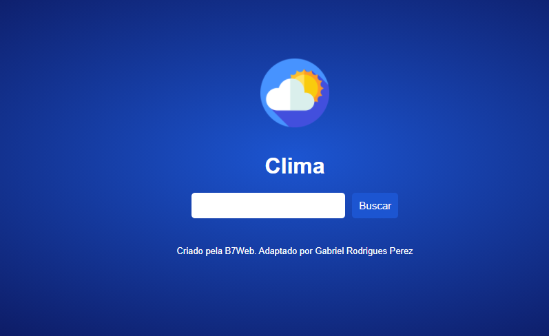

<div align="center" id="top"> 
  

&#xa0;

  <!-- <a href="https://projeto3.netlify.com">Demo</a> -->
</div>

<h1 align="center">Clima</h1>

<p align="center">
  

  

  

  

</p>

<p align="center">
  <a href="#dart-sobre">Sobre</a> &#xa0; | &#xa0; 
   <a href="#white_check_mark-pré-requesitos">Pré requisitos</a> &#xa0; | &#xa0;
  <a href="#checkered_flag-começando">Começando</a> &#xa0; | &#xa0;
  <a href="#memo-licença">Licença</a> &#xa0; | &#xa0;
  <a href="https://github.com/Gabriel4420" target="_blank">Autor</a>
</p>

<br>

## :dart: Sobre

Projeto de verificação de clima através da api current weather, utllizando fetch para consumir a api e gerar um buscador por pais / cidade, para a verificação do clima da mesma. Feito na semana javascript da b7web, ministrada pelo professor Bonieky Lacerda.

## :white_check_mark: Pré requisitos

Antes de começar :checkered_flag:, você precisa ter o [Git](https://git-scm.com) e o [Node](https://nodejs.org/en/) instalados em sua maquina.

## :checkered_flag: Começando

```bash
# Clone este repositório
$ git clone https://github.com/Gabriel4420/projeto-3


```

Feito com :heart: por <a href="https://github.com/Gabriel4420" target="_blank">Gabriel Rodrigues Perez</a>

&#xa0;

<a href="#top">Voltar para o topo</a>
